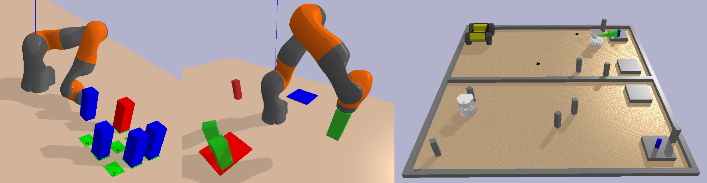

# COAST
This code implements the algorithm in the 2024 ICRA paper [Constraints and Streams for Task and Motion Planning](https://ieeexplore.ieee.org/document/10611670)



### Prerequisites

- Python 3.9 or higher
- Conda (recommended for environment management)

## Setup Conda environment
```
conda create -n coast python=3.9
conda activate coast
pip install -e .
```

## Installing external libraries from source
```
mkdir external && cd external

git clone --branch coast_changes https://github.com/branvu/pybullet-planning.git
cd pybullet_planning
pip install -e .
cd ..

git clone https://github.com/aibasel/downward.git
cd downward
git checkout bc6cf7a691fa43276f19b92a7c70c3098e7672ef
python build.py
cd ..

git clone https://github.com/branvu/symbolic.git
cd symbolic
conda install -c conda-forge cmake=3.25
pip install -e .
cd ../..
```

### Run Benchmarks

### Run Rover Domain (Ported from [PDDLStream](https://github.com/caelan/pddlstream))
```
python envs/rover/run.py
```
### Run PR2 Sorting
```
python envs/sorting/run.py
```
### Run Kuka "Kitchen" (Ported from [PDDLStream](https://github.com/caelan/pddlstream))
```
python envs/kuka/run.py
```
### Run Kuka Block
```
python envs/block/run.py
```

# Citation
```
@article{vu2024coast,
  author={Vu, Brandon and Migimatsu, Toki and Bohg, Jeannette},
  booktitle={2024 IEEE International Conference on Robotics and Automation (ICRA)}, 
  title={COAST: Constraints And Streams for Task and Motion Planning}, 
  year={2024},
  volume={},
  number={},
  pages={14875-14881},
  keywords={Algorithms;Probabilistic logic;Planning;Task analysis;Streams;Robots},
  doi={10.1109/ICRA57147.2024.10611670}}
```
